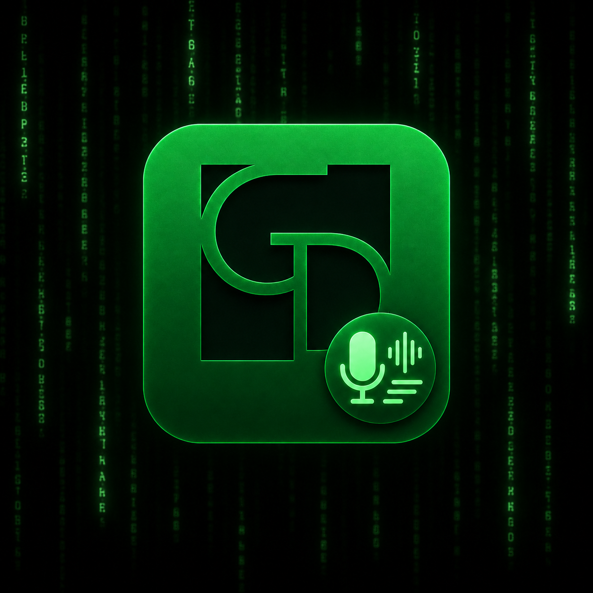

<p align="center">
  
</p>

# yt-transcriber

**Pipeline Trascrizione Audio/Video — Studio GD LEX**  
Versione 1.1.5 · 2026 · Licenza: GPL-3.0-or-later

---

## 1. Cos'è e a cosa serve

`yt-transcriber` è un programma con interfaccia grafica che permette di **trascrivere automaticamente** URL video / sorgenti online supportate da `yt-dlp` e file audio/video locali.

Dato un URL video pubblico supportato da `yt-dlp` oppure un file sul proprio computer, il programma:

1. scarica (o legge) l'audio;
2. può normalizzarlo opzionalmente per migliorare la qualità della trascrizione;
3. lo trascrive usando **Whisper** (motore AI di riconoscimento vocale);
4. pulisce e formatta il testo risultante;
5. salva la trascrizione nei formati scelti: Word (.docx), PDF, testo semplice (.txt), sottotitoli (.srt / .vtt).

È sviluppato da **Studio GD LEX** e ottimizzato per la lingua italiana.

Per impostazione predefinita il comportamento resta conservativo: non viene applicata alcuna normalizzazione automatica e `VOLUME_BOOST=1.0` non aggiunge alcun filtro audio. Se serve, è possibile attivare opzionalmente `AUDIO_NORMALIZE=1` per usare `ffmpeg loudnorm` su audio troppo basso, troppo alto o irregolare. `VOLUME_BOOST` resta disponibile come opzione manuale e viene usato solo quando `AUDIO_NORMALIZE=0`.

La normalizzazione audio è ora disponibile anche dalla GUI tramite toggle Matrix `Normalizza audio`, disattivato di default. Quando il toggle è attivo la GUI passa `AUDIO_NORMALIZE=1` alla pipeline; quando è disattivo passa `AUDIO_NORMALIZE=0`.

### Novità v1.1.0

- system tray icon opzionale con menu contestuale
- notifiche minime per completamento, errore e annullamento
- single-instance: un nuovo avvio richiama l'istanza già aperta
- Matrix rain idle nel pannello LOG con white rabbit asset-based
- rifinitura cromatica della card `TRASCRIZIONE LIVE`

### Bugfix v1.1.1

- gestione robusta di `whisper-cli` e del modello Whisper
- supporto env `YT_TRANSCRIBER_WHISPER_BIN` e `YT_TRANSCRIBER_WHISPER_MODEL`
- blocco avvio pipeline se backend Whisper mancante
- warning chiaro per prima installazione senza `whisper.cpp` o modello `.bin`
- documentazione backend Whisper aggiornata nel README

Nota prudente: il supporto delle sorgenti online resta dipendente da `yt-dlp`; in particolare il caveat YouTube sul runtime JavaScript assente resta da monitorare come tema infrastrutturale futuro.

---

## 2. Requisiti

### Obbligatori

| Componente | Versione minima | Note |
|---|---|---|
| Python | 3.10+ | Incluso nella maggior parte delle distribuzioni Linux |
| PyQt6 | qualsiasi | Libreria Python per l'interfaccia grafica |
| ffmpeg | qualsiasi | Elaborazione audio/video |
| Node.js | 16+ | Generazione documenti Word |
| yt-dlp | qualsiasi | Download da sorgenti online supportate |
| bc | qualsiasi | Calcolo avanzamento nella shell |
| whisper.cpp | compilato | Motore di trascrizione (vedi sezione installazione) |
| Modello Whisper | — | File `.bin` da scaricare separatamente |

### Opzionali

| Componente | A cosa serve |
|---|---|
| faster-whisper (Python) | Fallback se whisper.cpp non è disponibile |
| openai-whisper (Python) | Secondo fallback |
| pandoc o fpdf2 | Generazione PDF |
| xclip | Copia percorso file negli appunti |

### Ambiente

- Sistema operativo: **Linux** (pacchetto `.deb` per Debian/Ubuntu/derivate)
- È necessario un **ambiente grafico** (desktop) per avviare l'interfaccia
- GPU AMD, Intel o NVIDIA consigliata per trascrizioni veloci (ma non obbligatoria)

---

## 3. Installazione

### Opzione A — Pacchetto .deb (consigliata)

Se si dispone di un pacchetto `.deb` già generato o scaricato dalla release GitHub:

```bash
sudo dpkg -i yt-transcriber_<version>_amd64.deb
sudo apt-get install -f   # risolve eventuali dipendenze mancanti
```

Il programma verrà installato in `/usr/lib/yt-transcriber/` e sarà disponibile come comando `yt-transcriber`.

### Opzione B — Esecuzione diretta dalla cartella sorgente

Installare manualmente le dipendenze Python e Node.js, poi avviare direttamente gli script (vedi sezione 4).

```bash
# Dipendenze Python
pip install PyQt6 --break-system-packages

# Dipendenze Node.js (già presenti in node_modules/)
# Se la cartella node_modules mancasse o andasse rigenerata localmente:
npm ci
```

## 3.1 Backend Whisper

Il pacchetto `.deb` **non include** `whisper.cpp`.

Il pacchetto `.deb` **non include** i modelli Whisper `.bin`.

Per funzionare, `yt-transcriber` richiede:

- un backend `whisper-cli` funzionante;
- un modello Whisper `.bin` disponibile sul filesystem.

L'installazione e la configurazione di `whisper.cpp` restano a carico dell'utente.

Per i file locali `yt-dlp` non è necessario. Per URL video / sorgenti online, `yt-dlp` resta invece necessario.

Se `whisper.cpp` non è disponibile, la pipeline shell può usare un backend Python già installato basato su `faster-whisper`, ma il backend di trascrizione resta comunque esterno al pacchetto `.deb`.

### Ricerca automatica di `whisper-cli`

La GUI e la pipeline cercano `whisper-cli` in questo ordine:

1. variabile ambiente `YT_TRANSCRIBER_WHISPER_BIN`
2. `whisper-cli` trovato nel `PATH`
3. `~/whisper.cpp/build-vulkan/bin/whisper-cli`
4. `~/whisper.cpp/build-cuda/bin/whisper-cli`
5. `~/whisper.cpp/build/bin/whisper-cli`
6. `/usr/local/bin/whisper-cli`
7. `/usr/bin/whisper-cli`

Per retrocompatibilità, la pipeline accetta anche `WHISPER_BIN`.

### Ricerca automatica del modello Whisper

La GUI e la pipeline cercano il modello selezionato (`ggml-medium.bin`, `ggml-small.bin`, `ggml-large-v3.bin`, ecc.) in questo ordine:

1. variabile ambiente `YT_TRANSCRIBER_WHISPER_MODEL`
2. `~/whisper.cpp/models/`
3. `~/.local/share/yt-transcriber/models/`
4. `/usr/share/yt-transcriber/models/`
5. `/usr/local/share/whisper.cpp/models/`

Per retrocompatibilità, la pipeline accetta anche `WHISPER_MODEL`.

La GUI abilita l'avvio se trova `whisper.cpp` configurato oppure, in alternativa, un fallback Python `faster-whisper` disponibile; in caso contrario lascia disabilitato `Avvia pipeline` e mostra un warning chiaro invece di andare in traceback.

### Configurazione temporanea tramite variabili ambiente

```bash
export YT_TRANSCRIBER_WHISPER_BIN="$HOME/whisper.cpp/build-vulkan/bin/whisper-cli"
export YT_TRANSCRIBER_WHISPER_MODEL="$HOME/whisper.cpp/models/ggml-medium.bin"
yt-transcriber
```

### Installazione di whisper.cpp

Questo resta il passaggio più complesso. In uno scenario tipico `whisper.cpp` viene compilato manualmente e posizionato in `~/whisper.cpp/`.

### Download dei modelli Whisper

I modelli vanno scaricati separatamente. Una collocazione consigliata resta `~/whisper.cpp/models/`. Tre opzioni disponibili:

| Modello | Dimensione | Qualità | Velocità |
|---|---|---|---|
| `ggml-small.bin` | ~500 MB | base | molto veloce |
| `ggml-medium.bin` | ~1.5 GB | buona | veloce |
| `ggml-large-v3.bin` | ~3 GB | massima | lento |

```bash
# Esempio: scarica il modello medium
cd ~/whisper.cpp/models/
bash download-ggml-model.sh medium
```

---

## 4. Come avviare il programma

### Con il pacchetto .deb installato

```bash
yt-transcriber
```

### Direttamente dalla cartella sorgente

```bash
python3 yt-transcriber_gui.py
```

### Dalla riga di comando (senza interfaccia grafica)

```bash
# URL video / sorgente online
bash yt-transcriber.sh "https://www.youtube.com/watch?v=..." "Titolo opzionale" ~/Trascrizioni

# File locale
bash yt-transcriber.sh --local /percorso/al/file.mp3 "Titolo opzionale" ~/Trascrizioni
```

### Diagnostica del backend

```bash
python3 transcriber_backend.py
```

Mostra quale motore di trascrizione è attivo (GPU Vulkan, CUDA, CPU, o fallback Python).

---

## 5. Struttura dei file principali

```
yt-transcriber/
│
├── yt-transcriber_gui.py     # Interfaccia grafica (PyQt6)
│                             # Avvia la pipeline, mostra log e progresso
│
├── transcriber_backend.py    # Rilevamento automatico del backend Whisper
│                             # Gestisce whisper.cpp, faster-whisper, openai-whisper
│
├── yt-transcriber.sh         # Script bash che esegue la pipeline completa:
│                             # download sorgente online / file locale → audio → trascrizione → output
│
├── make_docx_styled.js       # Genera il documento Word (.docx) formattato
│                             # Usa la libreria Node.js "docx"
│
├── set_lang_it.py            # Imposta la lingua italiana nei file .docx prodotti
│
├── build_deb.sh              # Costruisce il pacchetto .deb installabile
│
├── yt-transcriber_<version>_amd64.deb   # Pacchetto installabile generato per una release
│
├── package.json              # Dipendenze Node.js (libreria docx)
└── node_modules/             # Librerie Node.js (generate da npm install)
```

**Cartella output predefinita:** `~/Trascrizioni/`  
**Cronologia trascrizioni:** `~/.config/yt-transcriber/history.json`

---

## 6. Problemi noti e limitazioni

- **Compilazione whisper.cpp richiesta:** non è installabile tramite `apt` o `pip`; va compilato manualmente dal sorgente. Questa è la parte più tecnica dell'installazione.
- **Modelli da scaricare manualmente:** i file `.bin` sono di grandi dimensioni (da 500 MB a 3 GB) e non sono inclusi nel pacchetto.
- **Burn-in sottotitoli solo su file locali:** la funzione "brucia sottotitoli nel video" non è disponibile per i video YouTube (solo per file già presenti sul disco).
- **PDF opzionale:** la generazione PDF richiede `pandoc` (consigliato) o la libreria Python `fpdf2`. Senza di essi, il formato PDF non viene prodotto.
- **Richiede ambiente grafico:** l'interfaccia non funziona in modalità headless (es. server senza desktop). In quel caso usare `yt-transcriber.sh` da riga di comando.
- **xclip per gli appunti:** il pulsante "Apri in Claude" copia il percorso del file negli appunti solo se `xclip` è installato (`sudo apt install xclip`).
- **Supporto sorgenti online prudente:** il supporto effettivo dipende da `yt-dlp`, dagli extractor disponibili, dalla natura pubblica del contenuto e da eventuali richieste di login/cookie.
- **Validazioni senza login registrate:** YouTube, Vimeo, Facebook Reel pubblico e Instagram Reel pubblico sono stati validati nei test pre-release della v1.0.9.
- **Piattaforme non garantite in ogni caso:** Facebook video classico e TikTok senza login/cookie non sono garantiti nel perimetro attuale.
- **Fallback consigliato:** se una sorgente online fallisce o richiede login/cookie, scaricare esternamente il file e usare poi la modalità File locale.

---

## Documentazione

- `docs/BUILD.md` — build locale e verifiche
- `docs/RELEASE.md` — procedura release/tag e workflow automatico
- `docs/TROUBLESHOOTING.md` — problemi frequenti
- `CHANGELOG.md` — storico sintetico delle versioni
- `SECURITY.md` — segnalazione problemi di sicurezza
- `CONTRIBUTING.md` — regole di contribuzione

---

## 7. Autore e licenza

**Autore:** Studio GD LEX  
**Contatto:** info@studiogdlex.it  
**Licenza del codice:** `GPL-3.0-or-later`. Il testo completo della licenza è disponibile nel file [LICENSE](LICENSE).  
**Garanzie e responsabilità:** il software è fornito "as is", senza garanzie di accuratezza, completezza, idoneità a uno scopo specifico o assenza di errori. L'utente resta responsabile della verifica delle trascrizioni e dei file prodotti. L'autore non assume responsabilità per errori, malfunzionamenti, risultati incompleti o conseguenze dell'uso.  
**Nome, marchio e identità visiva:** la licenza GPL applicata al codice non autorizza l'uso del nome, marchio, logo o identità visiva **STUDIO GD LEX** per presentare fork, versioni modificate o redistribuzioni come ufficiali, approvati o affiliati allo Studio.  
**Affiliazioni di terze parti:** il progetto non è affiliato a OpenAI, Anthropic, YouTube, Google, `yt-dlp`, FFmpeg, `whisper.cpp` o ad altri strumenti e servizi di terze parti eventualmente citati.  
**Componenti di terze parti:** vedi anche [THIRD_PARTY_LICENSES.md](THIRD_PARTY_LICENSES.md).
